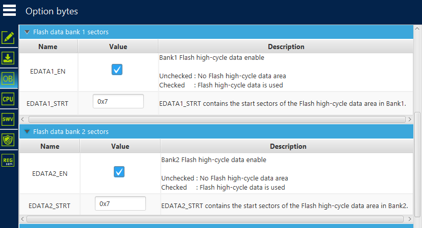

# STM32H5_HighCycleMem

Simple Test-Project for demonstrating High-Cycle Flash present in STM32H5 Series

This should allow to test High-Cycle Flash interaction with eblink.
More discussion can be found in the [eblink forum](https://embitz.org/forum/thread-205-post-858.html).

# Behavior

## Setup:

- Set up high cycle flash to contain 8 pages in both banks in STM32CubeProgrammer
    - EDATA1_EN enabled
    - EDATA1_STRT = 0x7
    - EDATA2_EN enabled
    - EDATA2_STRT = 0x7

    

- Set two breakpoints in main
    - one at src/main.c:73
    - one at src/main.c:81
- start debugging

## This should happen

1. Debugger flashes data section into high-cycle flash at address `0x09001800`
2. `main()` checks the contents of the data section in high-cycle flash
    - data_section_integrity marks if it contains correct data
3. breakpoint 1 in line 73 should hit now
    - **dont do anything! reading virgin flash causes double ECC fault, which causes a currently unhandled interrupt!**
    - **only read after one write sequence has been executed!**
4. breakpoint 2 in line 81 should hit now
5. addresses `0x09000000` - `0x09000008` should contain now: `0x0123 0x4567 0x89AB 0xCDEF`
    - check this via gdb:
        - `x/4xh 0x0900C000`
6. afterwards, continue
7. breakpoint 1 in line 73 should hit now
8. addresses `0x09000000` - `0x09000008` should contain now: `0x7f7f 0x5d5d 0xc8c8 0x0101`
    - check this via gdb:
        - `x/4xh 0x0900C000`
9. afterwards, continue 
10. go to step 4.
